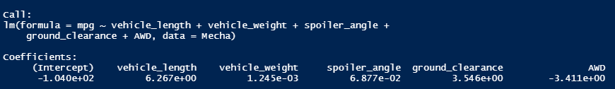
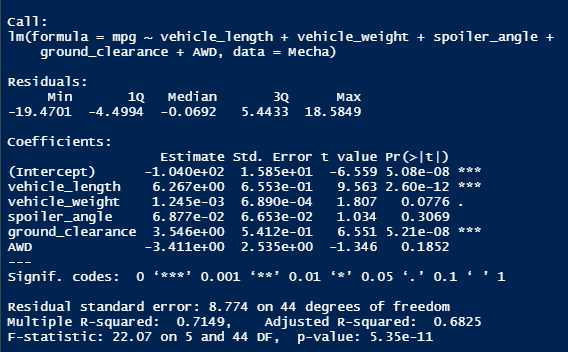

# MechaCar_Statistical_Analysis

## Linear Regression to Predict MPG

In this first section we are working with linear regression using the **lm()** function and the library **dplyr**.

First it is needed to hold the csv file into a variable than later we are going to be using to perform the regression.

Then  we use the summary to get more information about the regression such as the p-value and the r-squared value.

Here we got the summary of our linear regression, where we can see the Pr(>|t|) value where is shown where the values in the linear regression intercept and t value that shows where is the interception of the linear regression.

- Which variables/coefficients provided a non-random amount of variance to the mpg values in the dataset?
    - Non-random variables/Coefficients : vehicle_weight, spoiler_angle and AWD.
    - Random variables/coefficients: vehicle_length and ground_clearance
    
- Is the slope of the linear model considered to be zero? Why or why not?
    - The P value is less than 0.05 so it cannot be considered as zero.

- Does this linear model predict mpg of MechaCar prototypes effectively? Why or why not?
    - No because the multiple R squared value is 0.71 which give us a 71% meaning it cannot give us am effective prediction of Mechacar prototypes.

---------------
