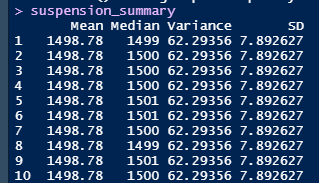
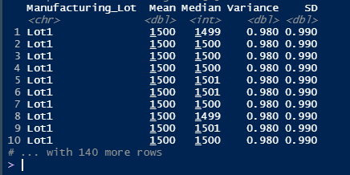

# MechaCar_Statistical_Analysis

## Linear Regression to Predict MPG

In this first section we are working with linear regression using the **lm()** function and the library **dplyr**.

First it is needed to hold the csv file into a variable than later we are going to be using to perform the regression.

Then  we use the summary to get more information about the regression such as the p-value and the r-squared value.

Here we got the summary of our linear regression, where we can see the Pr(>|t|) value where is shown where the values in the linear regression intercept and t value that shows where is the interception of the linear regression.

- Which variables/coefficients provided a non-random amount of variance to the mpg values in the dataset?
    - Non-random variables/Coefficients : vehicle_weight, spoiler_angle and AWD.
    - Random variables/coefficients: vehicle_length and ground_clearance
    
- Is the slope of the linear model considered to be zero? Why or why not?
    - The P value is less than 0.05 so it cannot be considered as zero.

- Does this linear model predict mpg of MechaCar prototypes effectively? Why or why not?
    - No because the multiple R squared value is 0.71 which give us a 71% meaning it cannot give us am effective prediction of Mechacar prototypes.

---------------
## Summary Statistics on Suspension Coils

First we are going to create a sumary using the PSI column to show the median, mean, variance and standard deviation.

Here we got the mean, median, variance and standard deviation using as we saw the PSI column. 

Then, we got the lot_summary using the group by function and we get the results.

- The design specifications for the MechaCar suspension coils dictate that the variance of the suspension coils must not exceed 100 pounds per square inch. Does the current manufacturing data meet this design specification for all manufacturing lots in total and each lot individually? Why or why not?
    - The problem is that in Lot 3 are shown a lot of variance, most of the data is X>100 when in the Lot 1 and 2 is less than 10. 

--------------------------------------------------------

## T-Tests on Suspension Coils
The lot 3 has a mean different from the other two it differs aprox 4 between the others. 
And the t of the third lot is a negative value so it differs from the other two *lots*

--------------------------------------------------------
## Study Design: MechaCar vs Competition
I think that it is important for the costumer to feel secure when driving a car and know the number of airbags and where they are located. 

- What metric or metrics are you going to test?
    - The number of airbags in the vehicle and show the deviation when a vehicle has a less airbags than the others and if there are vehjicles with more or less airbags than the other ones.

- What is the null hypothesis or alternative hypothesis?
    - The hypothesis is that every vehicle has 4 or even more airbags, this way we can see if a vehicle is safe or not.
- What statistical test would you use to test the hypothesis? And why?
    - The summary will show the median and the mode, this way we see if there are more or less 4 airbags.

- What data is needed to run the statistical test?
    - The number of airbags by vehicle and the total of vehicles.

